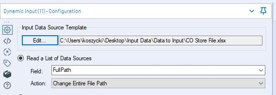

### Input Data Flowchart 


* #### Input Data with Wildcard

    1. Files in same directory , same type and same schema (same field names, same order, same data types)

    2. Connect a File or Database
    ```
    C:\Users\...\CO Store File - *.xlsx
    ```

    3. All of the data from these files is stacked on top of each other.

    If you want to see which file the data comes from, use the "Output File Name as Field" option in your Input Data tool configuration

    


* #### Dynamic Input with file paths
use a list of filepaths to feed a Dynamic Input.


    1. Files in same directory , same type and same schema (same field names, same order, same data types)

    2. A list of filepaths to import
    3. A file to populate the "Input Data Source Template" configuration of the Dynamic Input tool. This file will always have to be available for the tool to base its field schema on, and can be any of the files you wish to input. It *will not* be input if it is missing from the aforementioned file list.



    4. Some file types require a table or sheet specification, such as Microsoft Excel or Access database files. If the sheet or table name is always going to be the same, you won't have a problem with the Dynamic Input tool. 

    5. add the table/sheet to the end of the file path in the form
    ```
    <file path> |||<sheet/table>

    [FullPath] +"|||Sheet1$"
    ```

* #### Batch Macro with file paths
The batch macro will run a workflow one time for each file, updating the Input Data tool each time. 


    1. The Batch Macro will automatically read in files which have the same field schema without errors. But what happens if your field schema is different from one file to another?

    2. This is where the batch macro really comes into its own! Navigate to the Interface Designer , either use 
        * Auto Configure by Name - will union the fields with the same names
        * Auto Configure by Position - will union field 1 from file 1 on top of field 1 from file 2 and so on for every file


    3. Once you have configured the Interface Designer you can save the macro and insert it into your workflow (Right click on the canvas Insert > Macro...). There is an example workflow attached which includes dummy files and the Batch Macro to see how the process works.

### Text Input


 
